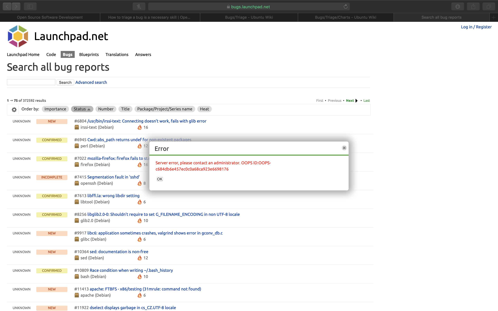

### Bug Triage: In search of a bug life
This week's assignment is a little different. Perhaps, a bit more challenging as well. First order of business is to learn about the business. So, the instructor assigned us some [readings](http://www.compsci.hunter.cuny.edu/~sweiss/course_materials/cs_ossd/assignments/assignment_12_bug_fixing.pdf).

#### Recce
According to [Schneeman](https://opensource.com/life/16/8/how-get-bugs-fixed-open-source-software), maintainers spend most of their time figuring out the exact scenario that causes the bug. Replicating the bug takes most of the time in the life of a bug. Much like a patient walking into the hospital, meta information is necessary to attempt to solve a problem. This process of gathering relevant information that is not self-reported and categorizing the issues into identifiable segments is called triaging. Until a bug can be reproduced, we need to gather more and more information. 

#### Separation of Dev and Triager
In middle to large scale FOSS projects, the bug triaging and fixing is usually done by two separate entities. Why? This ascertains that the developer spends time actually thinking about the bug rather than worrying about duplicates, *courteous* acknowledgments, priority detection and categorization. A non-specific bug should not even reach the developer's workflow according to [FedoraPeople](https://quaid.fedorapeople.org/TOS/Practical_Open_Source_Software_Exploration/html/sn-Debugging_the_Code-Bug_Triage.html). 

#### Nous commenceons la recherche 
Armed with this knowledge, we begin the bug search at the instructor's suggested location -- bugs.launchpad.net . Following the instructiions, I searched through all the bugs and tried to sort them with the **`NEW`** label on top. Alas. I was accosted with this cryptic error message. 

So, I manually sifted through the list of bugs with all different types of severity and triage status. We are looking for one that is interesting and has an **`Undecided`** status. In fact, it should be such that it is easy to replicate. 

#### Found a Moth instead of a Butterfly
While searching, I came across something peculiar. This particular [bug](https://bugs.launchpad.net/deja-dup/+bug/1808606) was asking the `Makefile` to be removed since the package has to be built using manual methods anyway. **How does one triage this?** Well, I dug into the Ubuntu bug triaging [guide](https://wiki.ubuntu.com/Bugs/Triage) and quickly identified that this was a feature request. However, there are two types of feature requests -- small and well-defined, and abstract. Here's the rub. The change, *per se*, is small -- just deleting a file. But, this particular suggestion seemed radical. So, I decied to go with the second category. Ubuntu provides a default canned reply to such requests and I simply copied it onto the request. Afterwards, I marked it as **Invalid**, per the insructions. 